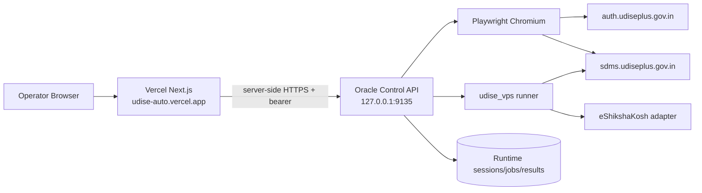

# AI Handoff — UDISE Automation Suite

> **Canonical handoff document. Read this first.**
>
> Repository: `zzpsah/udise-automation-suite`
> Live web app: `https://udise-auto.vercel.app/`
> Oracle runtime: `/home/prashant/projects/udise-automation-suite`
> Last architecture update: **2026-10-08**

## Current system

The project is no longer primarily a Colab notebook. The current operational architecture is:

1. **Next.js web UI on Vercel** — operator console.
2. **Oracle VPS control API** — owns login sessions, jobs, results and write safety.
3. **Headless Chromium / Playwright on Oracle** — performs the real UDISE Students Module login flow.
4. **`udise_vps` Python runner** — roster, snapshot, GP, EP, Facility, Completion and Finalize.
5. **eShikshaKosh adapter** — EP source data.
6. **Notebook baseline** — historical/interactive fallback.

Do not infer current behavior only from notebook-era docs.

## Current operator flow

```text
Open https://udise-auto.vercel.app/
        ↓
Username + Password + live CAPTCHA
        ↓
Oracle starts real Students Module OAuth in Chromium
        ↓
auth.udiseplus.gov.in → SDMS OAuth callback
        ↓
/p0/check-session must return HTTP 200
        ↓
Resolve school context from /p0/api/user
        ↓
For school login (regionType=6):
userRegionId = internal school ID
        ↓
Fetch school details
        ↓
Show Students Module connected + school name + UDISE code + session countdown
        ↓
Select Class IX / X / XI / XII
        ↓
Select workflow
        ↓
Run / Run & Save
```

## Login facts

- bootstrap: `https://sdms.udiseplus.gov.in/p0/oauth2/login`
- expected OAuth client: `udise-sdms-g0`
- CAPTCHA is captured from the same live Chromium page that submits the form
- browser follows the real OAuth callback
- login success requires `/p0/check-session == 200`
- password is not intentionally persisted by project code

## School scope facts

Do **not** use a hard-coded internal school ID after login.

Observed SDMS frontend behavior:
- `/p0/api/user` supplies `userRegionId`, `regionType`, `userId`, etc.
- for school login (`regionType == 6`), `userRegionId` is the internal school context
- school metadata is resolved from SDMS school APIs
- authenticated session scope overrides stale presets

## Production topology



## Read these in order

1. `docs/AI_HANDOFF.md`
2. `docs/ARCHITECTURE.md`
3. `docs/VISUAL_FLOWS.md`
4. `docs/API_REFERENCE.md`
5. `docs/LOGIN_FLOW.md`
6. `docs/WORKFLOW_ENGINE.md`
7. `docs/DEPLOYMENT.md`
8. `docs/TROUBLESHOOTING.md`
9. `docs/SECURITY.md`
10. `docs/REPOSITORY_MAP.md`
11. `hermes-vps/brain/hermes-vps/CURRENT_STATE.md`

Then inspect:
- `hermes-vps/control_api/app.py`
- `hermes-vps/web/app/page.tsx`
- `hermes-vps/web/app/lib.ts`
- `hermes-vps/udise_vps/session.py`
- workflow modules in `hermes-vps/udise_vps/`

## Code map

| Area | File |
|---|---|
| Oracle API | `hermes-vps/control_api/app.py` |
| Capabilities | `hermes-vps/control_api/capabilities.py` |
| Web UI | `hermes-vps/web/app/page.tsx` |
| Web → Oracle helper | `hermes-vps/web/app/lib.ts` |
| Web API proxies | `hermes-vps/web/app/api/**/route.ts` |
| UDISE session | `hermes-vps/udise_vps/session.py` |
| CLI runner | `hermes-vps/udise_vps/cli.py` |
| GP | `hermes-vps/udise_vps/general_profile.py` |
| EP | `hermes-vps/udise_vps/ep.py` |
| Facility | `hermes-vps/udise_vps/facility.py` |
| Completion | `hermes-vps/udise_vps/completion.py` |
| Snapshot | `hermes-vps/udise_vps/snapshot.py` |

## Current production write capability — 2026-10-08

The supported write modules are active in production:

- **GP:** IX, X, XI, XII
- **EP:** IX, X
- **Facility/FP:** IX, X, XI, XII
- **Complete Data / Finalize:** IX, X, XI, XII

The following remain intentionally read-only:

- Student Roster
- Full Snapshot
- Completion Overview

EP XI/XII is intentionally excluded because the portal's stream/subject mapping is not yet independently verified. This is a portal-contract limitation, not a disabled permission.

### Durable Run & Save

Write workflows now use a server-side durable transition. The UI sends auto_save=true with the preview request. After a successful preview, the Control API creates exactly one write child job linked by approved_from, caps it at 500 submissions, and starts it independently of the browser polling lifecycle. A browser refresh/disconnect therefore cannot strand a successful preview at Preview-only.

The write child performs a fresh pre-write read, one permitted POST per eligible record, and fresh read-back verification. Browser refresh/background suspension/disconnect does not cancel the server-side write child. The existing manual approval endpoint remains available as a recovery path. Read-only jobs never create a write child.

### Full Snapshot class scope

The Control API now forwards the selected class as --class <IX|X|XI|XII> to the snapshot runner. This fixes the previous risk where a Class X request could use the runner's default/Class IX scope. Regression coverage verifies all four class selectors and confirms snapshot remains read-only.

### Facility IX/X measurements

For blank height/weight fields only, the production Facility runner uses:

| Class | Gender | Height | Weight |
|---|---|---:|---:|
| IX–X | Boys | 140–160 cm | 38–55 kg |
| IX–X | Girls | 135–155 cm | 34–50 kg |
| XI–XII | Boys | 150–170 cm | 42–60 kg |
| XI–XII | Girls | 146–166 cm | 38–56 kg |

Existing saved measurements are never overwritten. Existing saved Yes values are never overwritten; conflicting dependent states are manual-review cases. Focused Facility regression coverage passes 13/13. These generated ranges are workflow defaults for unset fields, not a substitute for verified measurements.

## Safety model

Read-only:
- students
- snapshot
- completion

Write-capable:
- gp
- ep
- facility
- finalize

Internal write flow:

```text
fresh read
→ preview
→ eligible diff
→ bounded approval
→ fresh pre-write read
→ one write
→ fresh read-back
→ verify persisted result
```

Never add a direct write path that bypasses preview/read-back.

## Completion state

| formStatus | Project meaning |
|---:|---|
| 0 | GP + EP + Facility pending |
| 1 | GP complete; EP + Facility pending |
| 2 | GP + EP complete; Facility pending |
| 3 | ready for Complete Data |
| 6 | Complete Data completed |

Empirical project behavior, not an official enum.

## Git/deployment discipline

Before changes:

```bash
cd /home/prashant/projects/udise-automation-suite
git status --short
```

Known unrelated local modifications have existed in `.gitignore` and `hermes-vps/run_tests.sh`; do not stage them accidentally.

## Never commit

Passwords, bearer tokens, cookies, JSESSIONID, XSRF-TOKEN, live CAPTCHA data, raw student payloads, completed private workbooks or eShikshaKosh credentials.

## eShikshaKosh EP integration — current behavior

Enrollment Profile uses eShikshaKosh as a **read-only source**, not as a UDISE write target.

Purpose:
- match the same student across portals;
- obtain Admission Number when UDISE EP is blank;
- provide Class XI stream when available;
- retain source evidence in the EP preview/report.

UI source choices:
1. **Automatic fetch (recommended)** — temporary eShikshaKosh sign-in, then latest read-only report.
2. **Upload existing Excel (fallback)** — use a previously exported workbook.

The EP screen explicitly states that connecting eShikshaKosh does not write to UDISE.

Current portal-login behavior:
- eShikshaKosh encrypts the login form client-side and sends it to `/auth/login`;
- the private exporter captures the exact login response and surfaces the portal message;
- rejected credentials are reported as a reconnect/update-password action, not as a generic “no token captured” failure.

## EP source/template update — 2026-10-08

- For **Class X**, eShikshaKosh is optional. The EP workflow may run from the current UDISE record plus built-in subject/admission fallback rules.
- If an eShikshaKosh source is connected for Class X, it remains an optional Admission Number matching source.
- The generated EP template is live and pre-filled from UDISE when the portal returns the EP record.
- The workbook includes:
  - `Enrollment Profile` — effective values for review/edit;
  - `Current UDISE Values` — original saved portal values;
  - hidden `Subject Lists` — dropdown sources;
  - `Instructions`.
- Existing UDISE values are preserved and shown; only eligible blanks are auto-filled.
- Subject 1–6 cells have dropdown validation using the live UDISE subject catalogue when available, with the verified IX/X subject map as fallback.
- EP preview output also includes an `Enrollment Profile Review` sheet with Current / Proposed / Effective values.
- If every EP detail read fails, the workflow fails explicitly instead of reporting success with an empty/invalid review.

## Session / eShikshaKosh / Facility refresh — 2026-10-08

### eShikshaKosh connection semantics
- Connected means the official eShikshaKosh login was actually verified; merely storing credentials is not enough.
- The verified response exposes only safe identity metadata to the UI: school name and UDISE code.
- Temporary eShikshaKosh credentials are bound to the current UDISE session.
- The password is not shown as reusable/saved state. After a successful live source fetch, the temporary password record is deleted.
- The resulting eShikshaKosh workbook is passed automatically into the EP preview. Approved EP writes reuse the preview source workbook and do not need the password again.
- Class X keeps eShikshaKosh optional.

### UDISE session lifecycle
- The local safety TTL is 45 minutes, not an assumed eight-hour portal session.
- /p0/check-session is authoritative.
- While the page is visible, the browser verifies/refreshes the local window every 4 minutes.
- While a workflow subprocess is running, Oracle independently verifies the real portal session every 3 minutes.
- If the portal session expires mid-workflow, the runner is stopped and no blind retry is attempted.
- The UI label is Verified window, not a promise of portal lifetime.

### Facility measurements
- Boys: height 150–170 cm; weight 42–60 kg.
- Girls: height 146–166 cm; weight 38–56 kg.
- Existing saved measurements are never overwritten.


## Remember UDISE credential behavior

The login UI includes **Remember UDISE password on this Chrome profile**. The implementation uses the browser Credential Management API when available. Credentials are not intentionally stored in the Oracle control API or application database. Browser/Chrome support and policy determine whether the credential is actually saved.


## Development checkpoint — 9 October 2026

### Latest operator feedback / audit required

The operator reported that expected rules were not visible in the P4/information rules view, and that the browser-profile **Remember UDISE password** control was not visible in the UI screenshot. Documentation alone is not proof that these are present in the actual runtime UI or rule registry.

Before calling this complete, inspect the source of truth for P4/information rules, the Facility Profile workflow, and the deployed login UI. Reconcile runtime behavior, source code, generated rule/help content, and docs.

Required behaviors to preserve and verify:

- Facility Profile is blank-only: do not overwrite existing saved values.
- Existing saved **Yes** values remain protected; never flip them to No. Conflicting dependent values go to manual review.
- IX–X blank-field workflow defaults: boys 140–160 cm / 38–55 kg; girls 135–155 cm / 34–50 kg.
- XI–XII defaults documented in this repo: boys 150–170 cm / 42–60 kg; girls 146–166 cm / 38–56 kg. Do not imply live write verification where none exists.
- The login UI should expose the Remember UDISE password on this Chrome profile option. It uses the browser Credential Management API where supported; browser/Chrome policy controls actual persistence. Do not store the password in the Oracle API or app database.
- Keep preview-first writes, explicit bounded approval, fresh pre-write read, no blind POST retries, and fresh read-back verification.

### Separate eShikshaKosh downloader

A separate Next.js UI was deployed from `zzpsah/eshikshakosh-automation` at **https://eshikakoshapp.vercel.app**. It is not the UDISE application. At the last checkpoint its Generate action was still a placeholder; authenticated backend bridge and end-to-end Excel download remain pending. UDISE's existing EP eShikshaKosh adapter is a separate integration and must not be conflated with this standalone report-downloader deployment.

### Scope and deployment guardrails

- Keep UDISE production at `https://udise-auto.vercel.app/` separate.
- Do not modify `udise-login-staging`; the operator explicitly asked that staging be left alone.
- Keep eShikshaKosh and UDISE repositories/projects/deployments independent.
- UDISE development was paused by the operator while the standalone eShikshaKosh app was being set up. Treat the above as the next audit queue, not as authorization to change production or staging without the operator resuming UDISE work.
- Preserve unrelated working-tree modifications; never use broad reset/clean commands.
