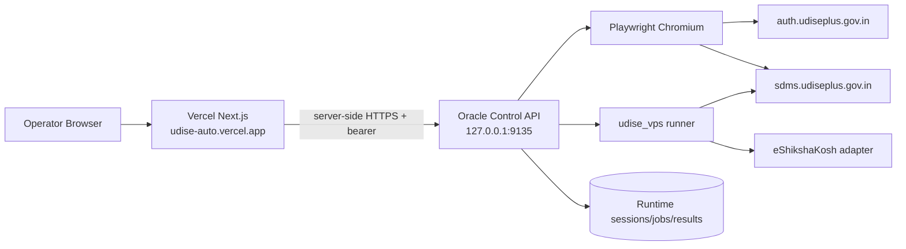

# AI Handoff — UDISE Automation Suite

> **Canonical handoff document. Read this first.**
>
> Repository: `zzpsah/udise-automation-suite`
> Live web app: `https://udise-auto.vercel.app/`
> Oracle runtime: `/home/prashant/projects/udise-automation-suite`
> Last architecture update: **2026-10-07**

## Current system

The project is no longer primarily a Colab notebook. The current operational architecture is:

1. **Next.js web UI on Vercel** — operator console.
2. **Oracle VPS control API** — owns login sessions, jobs, results and write safety.
3. **Headless Chromium / Playwright on Oracle** — performs the real UDISE Students Module login flow.
4. **`udise_vps` Python runner** — roster, snapshot, GP, EP, Facility, Completion and Finalize.
5. **eShikshaKosh adapter** — EP source data.
6. **Notebook baseline** — historical/interactive fallback.

Do not infer current behavior only from notebook-era docs.

## Current operator flow

```text
Open https://udise-auto.vercel.app/
        ↓
Username + Password + live CAPTCHA
        ↓
Oracle starts real Students Module OAuth in Chromium
        ↓
auth.udiseplus.gov.in → SDMS OAuth callback
        ↓
/p0/check-session must return HTTP 200
        ↓
Resolve school context from /p0/api/user
        ↓
For school login (regionType=6):
userRegionId = internal school ID
        ↓
Fetch school details
        ↓
Show Students Module connected + school name + UDISE code + session countdown
        ↓
Select Class IX / X / XI / XII
        ↓
Select workflow
        ↓
Run / Run & Save
```

## Login facts

- bootstrap: `https://sdms.udiseplus.gov.in/p0/oauth2/login`
- expected OAuth client: `udise-sdms-g0`
- CAPTCHA is captured from the same live Chromium page that submits the form
- browser follows the real OAuth callback
- login success requires `/p0/check-session == 200`
- password is not intentionally persisted by project code

## School scope facts

Do **not** use a hard-coded internal school ID after login.

Observed SDMS frontend behavior:
- `/p0/api/user` supplies `userRegionId`, `regionType`, `userId`, etc.
- for school login (`regionType == 6`), `userRegionId` is the internal school context
- school metadata is resolved from SDMS school APIs
- authenticated session scope overrides stale presets

## Production topology



## Read these in order

1. `docs/AI_HANDOFF.md`
2. `docs/ARCHITECTURE.md`
3. `docs/VISUAL_FLOWS.md`
4. `docs/API_REFERENCE.md`
5. `docs/LOGIN_FLOW.md`
6. `docs/WORKFLOW_ENGINE.md`
7. `docs/DEPLOYMENT.md`
8. `docs/TROUBLESHOOTING.md`
9. `docs/SECURITY.md`
10. `docs/REPOSITORY_MAP.md`
11. `hermes-vps/brain/hermes-vps/CURRENT_STATE.md`

Then inspect:
- `hermes-vps/control_api/app.py`
- `hermes-vps/web/app/page.tsx`
- `hermes-vps/web/app/lib.ts`
- `hermes-vps/udise_vps/session.py`
- workflow modules in `hermes-vps/udise_vps/`

## Code map

| Area | File |
|---|---|
| Oracle API | `hermes-vps/control_api/app.py` |
| Capabilities | `hermes-vps/control_api/capabilities.py` |
| Web UI | `hermes-vps/web/app/page.tsx` |
| Web → Oracle helper | `hermes-vps/web/app/lib.ts` |
| Web API proxies | `hermes-vps/web/app/api/**/route.ts` |
| UDISE session | `hermes-vps/udise_vps/session.py` |
| CLI runner | `hermes-vps/udise_vps/cli.py` |
| GP | `hermes-vps/udise_vps/general_profile.py` |
| EP | `hermes-vps/udise_vps/ep.py` |
| Facility | `hermes-vps/udise_vps/facility.py` |
| Completion | `hermes-vps/udise_vps/completion.py` |
| Snapshot | `hermes-vps/udise_vps/snapshot.py` |

## Safety model

Read-only:
- students
- snapshot
- completion

Write-capable:
- gp
- ep
- facility
- finalize

Internal write flow:

```text
fresh read
→ preview
→ eligible diff
→ bounded approval
→ fresh pre-write read
→ one write
→ fresh read-back
→ verify persisted result
```

Never add a direct write path that bypasses preview/read-back.

## Completion state

| formStatus | Project meaning |
|---:|---|
| 0 | GP + EP + Facility pending |
| 1 | GP complete; EP + Facility pending |
| 2 | GP + EP complete; Facility pending |
| 3 | ready for Complete Data |
| 6 | Complete Data completed |

Empirical project behavior, not an official enum.

## Git/deployment discipline

Before changes:

```bash
cd /home/prashant/projects/udise-automation-suite
git status --short
```

Known unrelated local modifications have existed in `.gitignore` and `hermes-vps/run_tests.sh`; do not stage them accidentally.

## Never commit

Passwords, bearer tokens, cookies, JSESSIONID, XSRF-TOKEN, live CAPTCHA data, raw student payloads, completed private workbooks or eShikshaKosh credentials.

## eShikshaKosh EP integration — current behavior

Enrollment Profile uses eShikshaKosh as a **read-only source**, not as a UDISE write target.

Purpose:
- match the same student across portals;
- obtain Admission Number when UDISE EP is blank;
- provide Class XI stream when available;
- retain source evidence in the EP preview/report.

UI source choices:
1. **Automatic fetch (recommended)** — temporary eShikshaKosh sign-in, then latest read-only report.
2. **Upload existing Excel (fallback)** — use a previously exported workbook.

The EP screen explicitly states that connecting eShikshaKosh does not write to UDISE.

Current portal-login behavior:
- eShikshaKosh encrypts the login form client-side and sends it to `/auth/login`;
- the private exporter captures the exact login response and surfaces the portal message;
- rejected credentials are reported as a reconnect/update-password action, not as a generic “no token captured” failure.

## EP source/template update — 2026-10-08

- For **Class X**, eShikshaKosh is optional. The EP workflow may run from the current UDISE record plus built-in subject/admission fallback rules.
- If an eShikshaKosh source is connected for Class X, it remains an optional Admission Number matching source.
- The generated EP template is live and pre-filled from UDISE when the portal returns the EP record.
- The workbook includes:
  - `Enrollment Profile` — effective values for review/edit;
  - `Current UDISE Values` — original saved portal values;
  - hidden `Subject Lists` — dropdown sources;
  - `Instructions`.
- Existing UDISE values are preserved and shown; only eligible blanks are auto-filled.
- Subject 1–6 cells have dropdown validation using the live UDISE subject catalogue when available, with the verified IX/X subject map as fallback.
- EP preview output also includes an `Enrollment Profile Review` sheet with Current / Proposed / Effective values.
- If every EP detail read fails, the workflow fails explicitly instead of reporting success with an empty/invalid review.
