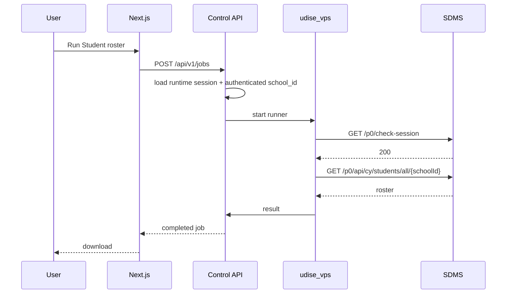

# API Reference — Web, Oracle and UDISE

Last updated: **2026-10-07**

## Vercel routes

| Browser route | Method | Oracle target |
|---|---|---|
| `/api/capabilities` | GET | `/api/v1/capabilities` |
| `/api/udise-login/start` | POST | `/api/v1/login-requests` |
| `/api/udise-login/captcha` | GET | `/api/v1/login-requests/{token}/captcha` |
| `/api/udise-login/submit` | POST | `/api/v1/login-requests/{token}/submit` |
| `/api/session-request` | POST | `/api/v1/session-requests` |
| `/api/session-status` | GET | `/api/v1/session-requests/{token}` |
| `/api/jobs` | POST | `/api/v1/jobs` |
| `/api/jobs/{id}` | GET | `/api/v1/jobs/{id}` |
| `/api/jobs/{id}/approve` | POST | `/api/v1/jobs/{id}/approve` |
| `/api/jobs/{id}/result` | GET | `/api/v1/jobs/{id}/result` |
| `/api/ep-template` | GET | `/api/v1/ep-template` |
| `/api/eshiksha-request` | POST | `/api/v1/eshiksha-requests` |
| `/api/eshiksha-status` | GET | `/api/v1/eshiksha-requests/{token}` |
| `/api/eshiksha-credentials` | POST | `/api/v1/eshiksha-credentials` |
| `/api/eshiksha-upload` | POST | `/api/v1/eshiksha-upload` |
| `/api/eshiksha-export` | GET | `/api/v1/eshiksha-export` |

## Oracle control API

Bind: `127.0.0.1:9135`
Source: `hermes-vps/control_api/app.py`

Routes:
- `GET /health`
- `GET /api/v1/capabilities`
- `POST /api/v1/login-requests`
- `GET /api/v1/login-requests/{token}/captcha`
- `POST /api/v1/login-requests/{token}/submit`
- `POST /api/v1/session-requests`
- `GET /api/v1/session-requests/{token}`
- `GET /session/{token}`
- `POST /session/{token}`
- `POST /api/v1/eshiksha-requests`
- `GET /api/v1/eshiksha-requests/{token}`
- `GET /eshiksha/{token}`
- `POST /eshiksha/{token}`
- `POST /api/v1/eshiksha-credentials`
- `POST /api/v1/eshiksha-upload`
- `GET /api/v1/eshiksha-export`
- `POST /api/v1/jobs`
- `GET /api/v1/jobs/{job_id}`
- `POST /api/v1/jobs/{job_id}/approve`
- `GET /api/v1/jobs/{job_id}/result`
- `GET /api/v1/jobs/{job_id}/eshiksha-report`
- `GET /api/v1/ep-template`

## UDISE endpoints

Base: `https://sdms.udiseplus.gov.in`

Session:
`GET /p0/check-session`

Identity:
`GET /p0/api/user`

Roster:
`GET /p0/api/cy/students/all/{schoolId}`

General Profile:
- `GET /p0/api/cy/students/{studentId}`
- `POST /p0/api/cy/students/{studentId}`

Enrollment:
- `GET /p0/api/v2/students/enrolment/{studentId}`
- `POST /p0/api/v2/students/enrolment/{studentId}`

Facility:
- `GET /p0/api/v2/students/facility/{studentId}`
- inspect `hermes-vps/udise_vps/facility.py` for the maintained write route

Finalize:
`POST /p0/api/v2/students/submit/{studentId}`

Success requires fresh read-back to `formStatus=6`.

## Roster call chain

