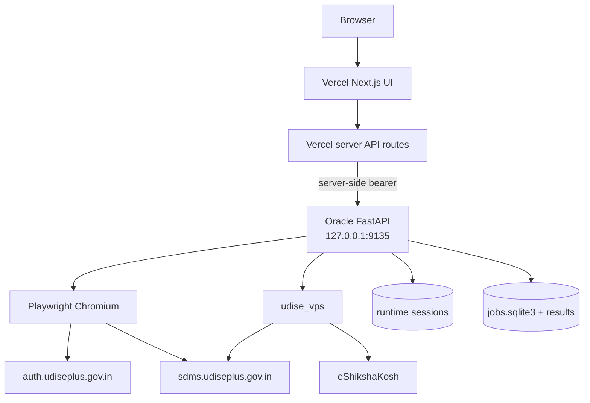
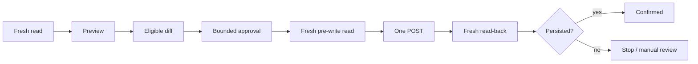

# Architecture — Current Production System

Last updated: **2026-10-08**

## System layers

### Vercel web app
Location: `hermes-vps/web/`
Production: `https://udise-auto.vercel.app/`

Responsibilities:
- login/class/workflow UI
- CAPTCHA proxy
- server-side Oracle proxy
- progress/results
- Students Module identity + session countdown

### Oracle control plane
Location: `hermes-vps/control_api/app.py`
Service: `udise-control-api.service`
Bind: `127.0.0.1:9135`

Responsibilities:
- login requests
- Playwright browser lifecycle
- runtime sessions
- authenticated school context
- jobs/results
- write safety
- eShikshaKosh temp source flow
- fallback session bridge

### Oracle local web
Service: `udise-web.service`
Bind: `127.0.0.1:3010`

### UDISE runner
Location: `hermes-vps/udise_vps/`

Responsibilities:
- session validation
- roster/profile reads
- previews
- guarded writes
- fresh read-back
- Excel output

### Portal hosts
- `https://auth.udiseplus.gov.in`
- `https://sdms.udiseplus.gov.in`

## Network topology

## Request boundaries

Browser calls only same-origin Vercel routes.

`hermes-vps/web/app/lib.ts` adds:
- `UDISE_ORACLE_API_URL`
- `UDISE_CONTROL_TOKEN`

server-side. Never expose them to browser JavaScript.

## Runtime storage

Durable:
`~/.hermes/state/udise-control/`

Ephemeral:
`$XDG_RUNTIME_DIR/udise-control/`

Contains:
- sessions
- session requests
- login requests
- eShiksha requests

Jobs DB:
`~/.hermes/state/udise-control/jobs.sqlite3`

## School identity

Do not confuse:
- 11-digit UDISE code
- internal SDMS school ID

For school-level login:
- `/p0/api/user`
- `regionType == 6`
- `userRegionId` = internal school context

Authenticated session school context overrides stale frontend presets.

## Durable write boundary

The production **Run & Save** path is server-durable. A successful preview creates exactly one bounded write child job linked to the approved preview. The child performs its own fresh pre-write read, sends permitted writes once, and performs fresh read-back verification. Browser refresh, background suspension, or disconnect does not cancel an already-created write child. Read-only stages never create a write child.

## Write boundary

No blind POST retry after ambiguous failure.

## Facility protected-value boundary

Facility automation is blank-only. Existing saved measurements and saved Yes/No values are preserved. An existing Yes is never silently changed to No. If a dependent state conflicts with a saved Yes, the record is retained for manual review.

Current IX/X blank measurement defaults:
- Boys: 140–160 cm, 38–55 kg
- Girls: 135–155 cm, 34–50 kg

XI/XII defaults remain:
- Boys: 150–170 cm, 42–60 kg
- Girls: 146–166 cm, 38–56 kg

These are workflow defaults for unset fields and do not replace actual measured values.

### EP student-level result output
Enrollment Profile runner events retain PEN, student name, status, and detail for each processed student. The Control API now exposes these EP rows directly to the UI as Status | PEN | Student | Detail instead of collapsing EP completion into an aggregate count.
