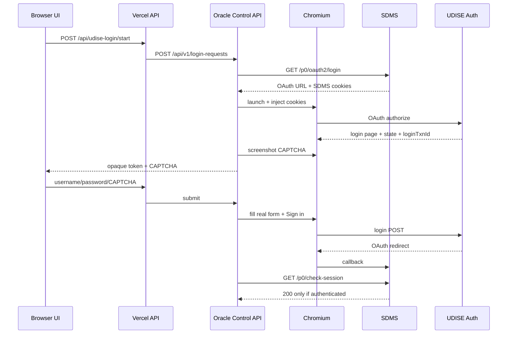

# UDISE Students Module Login Flow

Last updated: **2026-10-07**

## Bootstrap

`GET https://sdms.udiseplus.gov.in/p0/oauth2/login`

Expected OAuth client:
`udise-sdms-g0`

SDMS bootstrap cookies are injected into Chromium with original domain/path.

## Sequence

## Success

Only `/p0/check-session == 200` proves login.

Cookies alone do not prove authentication because SDMS creates bootstrap cookies before login.

## Post-login school bootstrap

1. `GET /p0/api/user`
2. if `regionType == 6`, use `userRegionId` as internal school ID
3. resolve school details
4. store `school_id`, `school_name`, `udise_code`
5. return safe metadata + session TTL to UI

## Timer

Backend application TTL: 8 hours.

UI displays `HH:MM:SS`.

Portal may expire earlier, so workflow requests must still handle auth rejection.

## Fallback

`Advanced / fallback login → Use existing browser session`
