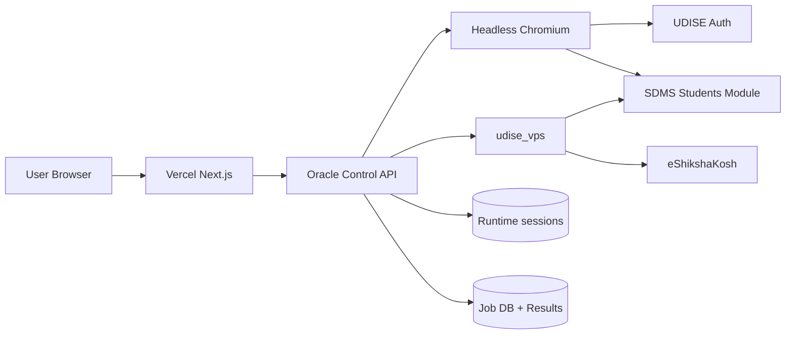
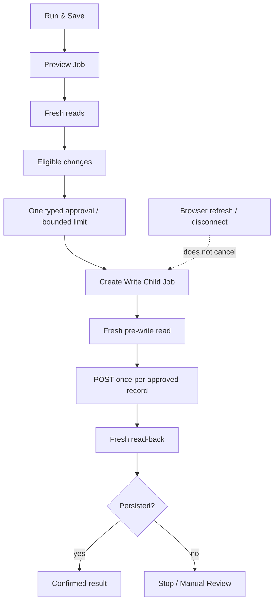
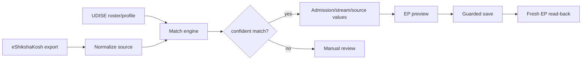
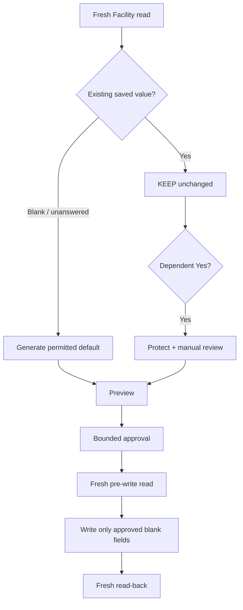
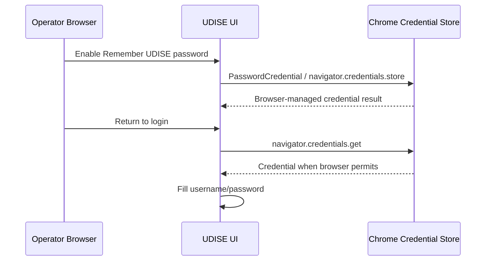

# Visual Flow Diagrams

## Full system



## Post-login school context

```mermaid
flowchart TD
    A[Authenticated] --> B[/p0/api/user]
    B --> C{regionType == 6?}
    C -->|yes| D[userRegionId = internal school ID]
    D --> E[School details API]
    E --> F[School name + UDISE code]
    F --> G[Students Module connected]
    G --> H[Session countdown]
    G --> I[Class selector]
    I --> J[Workflow selector]
```

## Write safety — durable Preview → Write



The write child is server-durable and independent of browser polling. Read-only stages never create a write child.

## eShikshaKosh → EP



## Facility Profile — protected values



Existing **Yes** values and other saved values are never overwritten.

## Remember UDISE credential



The application does not intentionally persist the password server-side.

## Deployment

```mermaid
flowchart LR
    G[GitHub main] --> O[Oracle clone]
    G --> V[Vercel Git project]
    O --> S1[udise-control-api.service]
    O --> S2[udise-web.service]
    V --> P[udise-auto.vercel.app]
    P --> Q[Production build verification]
```mermaid
flowchart LR
    G[GitHub main] --> O[Oracle clone]
    G --> V[Vercel project]
    O --> S1[udise-control-api.service]
    O --> S2[udise-web.service]
    V --> P[udise-auto.vercel.app]
```
