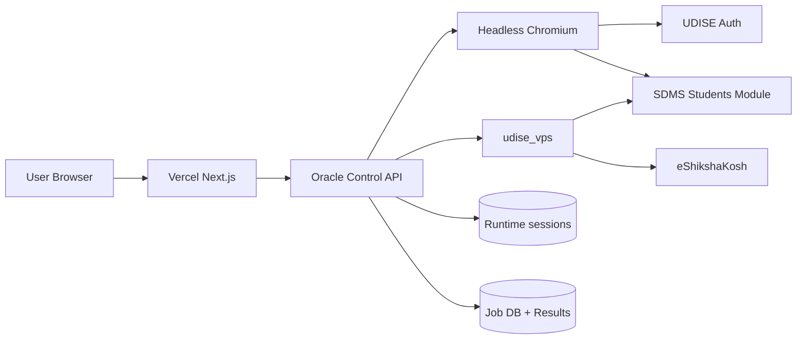
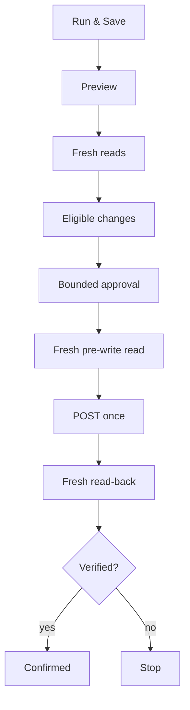
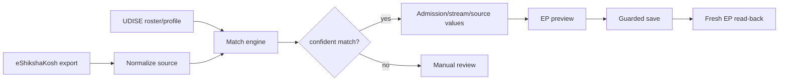
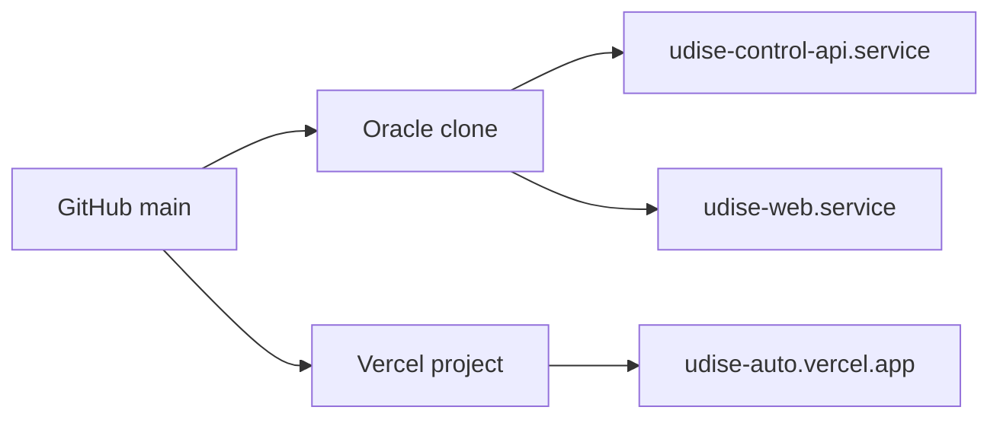

# Visual Flow Diagrams

## Full system



## Post-login school context

```mermaid
flowchart TD
    A[Authenticated] --> B[/p0/api/user]
    B --> C{regionType == 6?}
    C -->|yes| D[userRegionId = internal school ID]
    D --> E[School details API]
    E --> F[School name + UDISE code]
    F --> G[Students Module connected]
    G --> H[Session countdown]
    G --> I[Class selector]
    I --> J[Workflow selector]
```

## Write safety



## eShikshaKosh → EP



## Deployment


