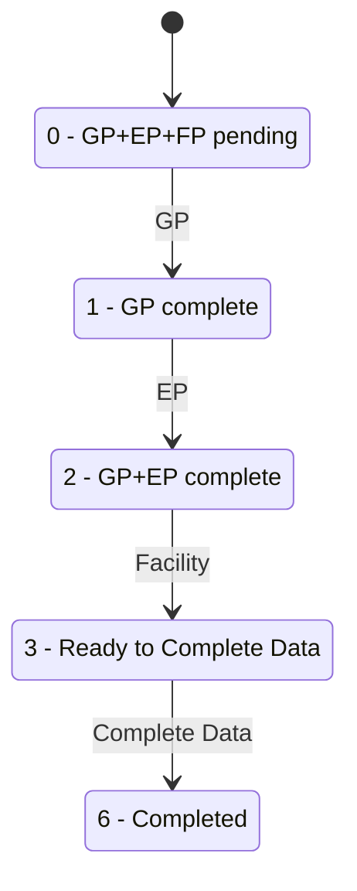
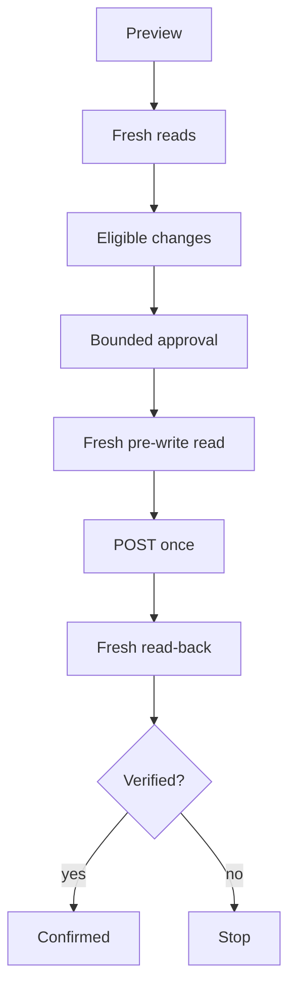

# Workflow Engine

## Stages

- `students`
- `snapshot`
- `gp`
- `ep`
- `facility`
- `completion`
- `finalize`

Capabilities: `hermes-vps/control_api/capabilities.py`

## Read-only

### students
Session validation, roster fetch, masked roster workbook.

### snapshot
Students, GP, EP, Facility, Completion, Issues.

### completion
Current status and status-3 ready set.

## GP

Blank-only defaults. Existing nonblank values are preserved.

Existing CWSN=Yes → skip/manual review.

GP payload requires identity block plus editable fields.

## EP

Combines UDISE profile + eShikshaKosh source.

### Why eShikshaKosh is connected

eShikshaKosh supplies source values for Enrollment Profile matching and proposals, especially:
- Admission Number;
- Class XI stream where available;
- supporting student identity evidence used by the match engine.

It is read-only from this workflow's perspective. Connecting or fetching eShikshaKosh data does **not** write to UDISE.

The UI offers:
- Automatic fetch (recommended);
- Upload existing Excel (fallback);
- EP review template as a utility.

Portal error `1002` means Board/Class subject mapping unavailable. Do not retry in a loop.

## Facility

Blank-only.

Important sentinels:
- `0` may mean unset measurement
- `9` may mean unanswered/not-applicable Yes/No

## Completion

Empirical project behavior.

## Finalize

1. fresh status
2. status 3 only
3. fresh read before write
4. one POST
5. no blind retry
6. fresh read-back
7. confirmed only at 6

## Preview/write

