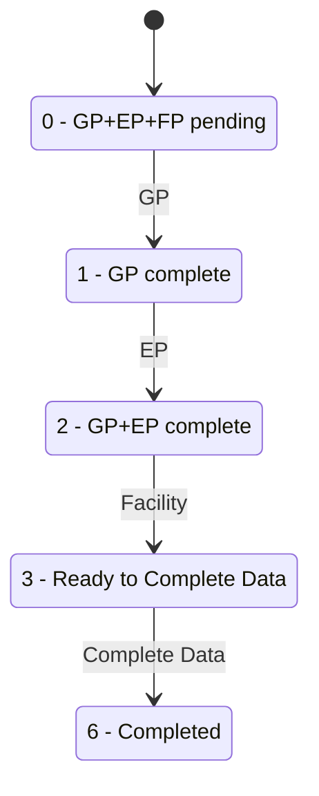
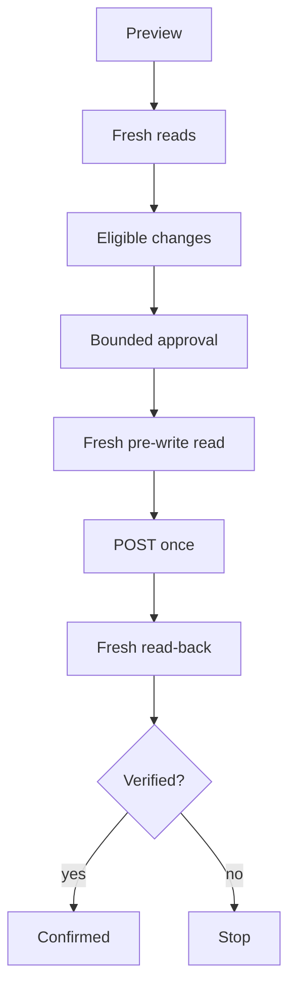

# Workflow Engine

## Stages

- `students`
- `snapshot`
- `gp`
- `ep`
- `facility`
- `completion`
- `finalize`

Capabilities: `hermes-vps/control_api/capabilities.py`

## Read-only

### students
Session validation, roster fetch, masked roster workbook.

### snapshot
Students, GP, EP, Facility, Completion, Issues.

### completion
Current status and status-3 ready set.

## GP

Blank-only defaults. Existing nonblank values are preserved.

Existing CWSN=Yes → skip/manual review.

GP payload requires identity block plus editable fields.

## EP

Combines UDISE profile + eShikshaKosh source.

### Why eShikshaKosh is connected

eShikshaKosh supplies source values for Enrollment Profile matching and proposals, especially:
- Admission Number;
- Class XI stream where available;
- supporting student identity evidence used by the match engine.

It is read-only from this workflow's perspective. Connecting or fetching eShikshaKosh data does **not** write to UDISE.

The UI offers:
- Automatic fetch (recommended);
- Upload existing Excel (fallback);
- EP review template as a utility.

Portal error `1002` means Board/Class subject mapping unavailable. Do not retry in a loop.

## Facility

Blank-only.

Important sentinels:
- `0` may mean unset measurement
- `9` may mean unanswered/not-applicable Yes/No

## Completion

Empirical project behavior.

## Finalize

1. fresh status
2. status 3 only
3. fresh read before write
4. one POST
5. no blind retry
6. fresh read-back
7. confirmed only at 6

## Preview/write

## EP source/template update — 2026-10-08

- For **Class X**, eShikshaKosh is optional. The EP workflow may run from the current UDISE record plus built-in subject/admission fallback rules.
- If an eShikshaKosh source is connected for Class X, it remains an optional Admission Number matching source.
- The generated EP template is live and pre-filled from UDISE when the portal returns the EP record.
- The workbook includes:
  - `Enrollment Profile` — effective values for review/edit;
  - `Current UDISE Values` — original saved portal values;
  - hidden `Subject Lists` — dropdown sources;
  - `Instructions`.
- Existing UDISE values are preserved and shown; only eligible blanks are auto-filled.
- Subject 1–6 cells have dropdown validation using the live UDISE subject catalogue when available, with the verified IX/X subject map as fallback.
- EP preview output also includes an `Enrollment Profile Review` sheet with Current / Proposed / Effective values.
- If every EP detail read fails, the workflow fails explicitly instead of reporting success with an empty/invalid review.

## Facility sex-aware measurement defaults — 2026-10-08

When height/weight are blank:
- male/boy students: height 150–170 cm, weight 42–60 kg;
- female/girl students: height 146–166 cm, weight 38–56 kg.

The student sex value is read from General Profile. The generator is used only for blank fields; saved measurements remain untouched.

## Session keepalive during workflows

Before a job starts, Oracle verifies the live SDMS session. While the job is running, Oracle checks /p0/check-session every 3 minutes and refreshes the local 45-minute safety window only when that portal check succeeds. If SDMS reports the session inactive, the subprocess is stopped and the job fails safely without a blind write retry.
